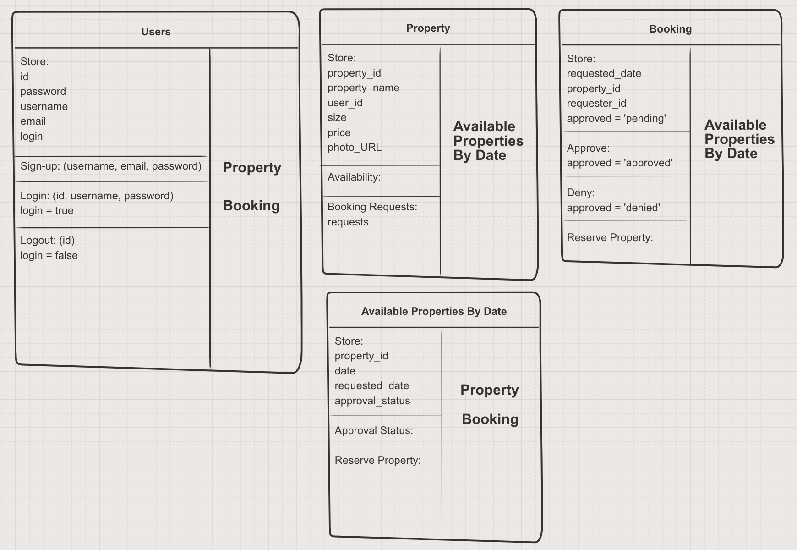
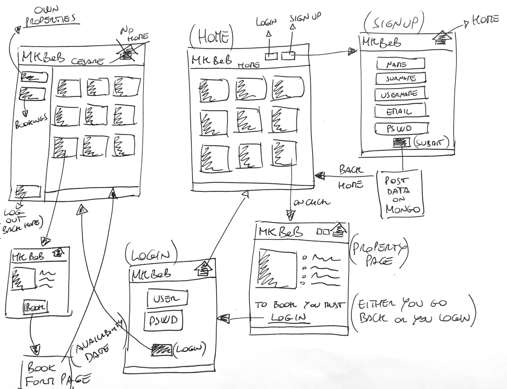

# MakersB&B

A webapp made in JS, Express and MongoDB were users can post, edit and delete
properties.

#### Made by
- [Cesare Camurani](https://github.com/cesarecamurani)
- [Christopher Zelaya](https://github.com/criszelaya24)
- [Jackie Dunne](https://github.com/kiedunne)
- [Tom Pickering](https://github.com/topickering)

### Instructions
```
git clone https://github.com/kiedunne/makersbandb.git

npm install

npm run dev

Open up localhost:3000 in any browser.
```

### For testing in Cypress

On app.js, comment out:
```
app.listen(3000, function() {
  console.log('Server started on port 3000');
})
```

Since we’re using port 3000 for both running and testing, which requires running, we get a port 3000 in use error if this isn’t commented out.

Then run:
```
npm run test:cypress:dev
```

This command does two things:
 	1. Starts the development server on localhost: 3000 by using npm start
	2. Starts Cypress and runs local tests

Will fix this in future revisions.


### User Stories
```
As a user,
So I can join MakersB&B
I want to be able to sign up

As a signed-up user,
So I can post a property under my name,
I want to be able to sign in

As a signed-in user,
So I can advertise as many properties as I want,
I want to be able to post many properties

As a MakersB&B user,
So other members have relevant details about my advertise properties,
I can post a property with a name, description and price
```

## Planning

### Class Diagram


### User Navigation

